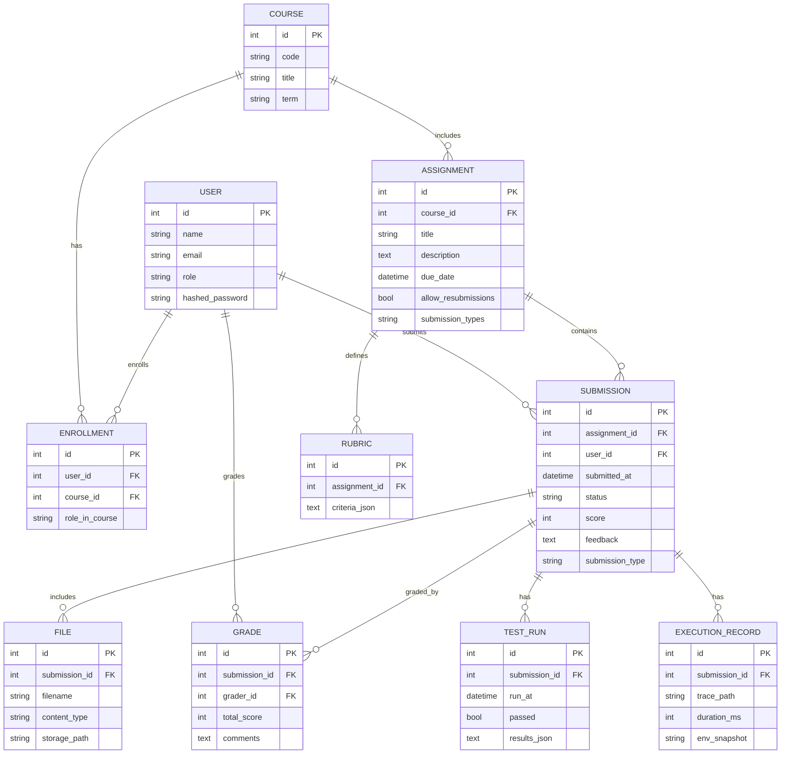

```mermaid
erDiagram
  USER {
    int id PK
    string name
    string email
    string role
    string hashed_password
  }
  COURSE {
    int id PK
    string code
    string title
    string term
  }
  ENROLLMENT {
    int id PK
    int user_id FK
    int course_id FK
    string role_in_course
  }
  ASSIGNMENT {
    int id PK
    int course_id FK
    string title
    text description
    datetime due_date
    bool allow_resubmissions
    string submission_types
  }
  SUBMISSION {
    int id PK
    int assignment_id FK
    int user_id FK
    datetime submitted_at
    string status
    int score
    text feedback
    string submission_type
  }
  FILE {
    int id PK
    int submission_id FK
    string filename
    string content_type
    string storage_path
  }
  TEST_RUN {
    int id PK
    int submission_id FK
    datetime run_at
    bool passed
    text results_json
  }
  RUBRIC {
    int id PK
    int assignment_id FK
    text criteria_json
  }
  GRADE {
    int id PK
    int submission_id FK
    int grader_id FK
    int total_score
    text comments
  }
  EXECUTION_RECORD {
    int id PK
    int submission_id FK
    string trace_path
    int duration_ms
    string env_snapshot
  }

  USER ||--o{ ENROLLMENT: enrolls
  COURSE ||--o{ ENROLLMENT: has
  COURSE ||--o{ ASSIGNMENT: includes
  ASSIGNMENT ||--o{ SUBMISSION: contains
  SUBMISSION ||--o{ FILE: includes
  SUBMISSION ||--o{ TEST_RUN: has
  ASSIGNMENT ||--o{ RUBRIC: defines
  SUBMISSION ||--o{ GRADE: graded_by
  SUBMISSION ||--o{ EXECUTION_RECORD: has
  USER ||--o{ SUBMISSION: submits
  USER ||--o{ GRADE: grades
```