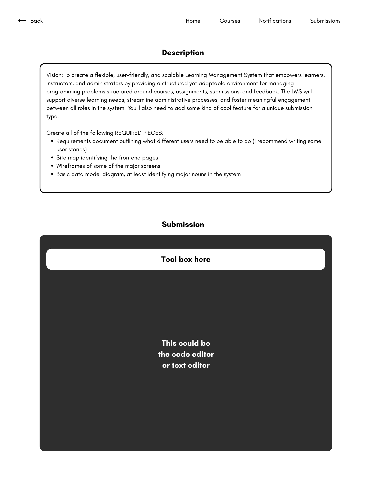

# Requirements & Design Documentation
This document was created with the help of Claude (not entirely, it was involved in the polishing tasks)
## Project Vision
To create a Learning Management System with a mystical tarot aesthetic that gives learners a unique learning experience through multiple submission types including traditional code, solution walkthroughs, and reverse programming challenges.

## Unique Features
The mystical LMS stands out with three divination methods for knowledge assessment:

1. **Traditional Code Submission**: Pure logical incantations through code
2. **Solution Walkthrough**: Students channel their understanding through spoken/written wisdom. An LLM/agentic workflow then is used to verify if their "solution walkthrough" make a good prompt that is enough to instruct an LLM to give the right solution.   
3. **Reverse Programming**: Reading the runes - interpreting existing code to divine its purpose (rewriting Dr. Bart BlockPy assignment instructions from given solutions)

## Complete Documentation Package

### Core Documents
- **Site Map**: [sitemap.mermaid](./sitemap.mermaid) - MVP Scope of all FE pages
- **Data Model**: [datamodel.mermaid](./datamodel.mermaid) - Entity relationships and database structure (Basic, more will include as the dev process goes on)

### Visual Design References
- **Home Dashboard**:  - Main dashboard with progress crystal ball and quest cards
- **Course Catalog**:  - Tarot card display of available courses
- **Assignment Interface**:  - Submission interface with three mystical methods
- **More page interfaces coming soon**

## User Stories

### Students

#### Core Navigation & Dashboard
- **As a student**, I want to see my home dashboard with a progress crystal ball, active quest cards (assignments), and clickable notifications so I can quickly navigate my learning journey
- **As a student**, I want to click on unread messages, grade updates, and assignment notifications from my home dashboard so I can stay informed without navigating multiple pages
- **As a student**, I want a calendar widget showing due dates and a progress indicator so I can manage my time effectively

#### Course Management
- **As a student**, I want to see my courses displayed as beautiful tarot cards with medieval illustrations so learning feels engaging and mystical
- **As a student**, I want to enroll in courses and view my progress within each course path

#### Unique Submission System
- **As a student**, I want to submit solutions in three mystical ways (traditional code, walkthrough explanation, reverse programming) so I can demonstrate understanding through different methods
- **As a student**, I want to choose between The Scribe (code), The Oracle (walkthrough), or The Sage (reverse programming) for each assignment based on my learning style
- **As a student**, I want to save draft submissions and return to complete them later

#### Progress Tracking
- **As a student**, I want to view all my past submissions and drafts in one place so I can track my progress and continue incomplete work
- **As a student**, I want to see my grades and feedback for each submission type
- **As a student**, I want to filter my submission history by course, assignment, or submission type

### Instructors

#### Course & Assignment Creation
- **As an instructor**, I want to create assignments that support three submission types (code, walkthrough, reverse programming) so I can assess different learning dimensions
- **As an instructor**, I want to specify which submission types are allowed for each assignment (one, two, or all three)
- **As an instructor**, I want to provide clear instructions and examples for each submission type

#### Grading & Feedback
- **As an instructor**, I want to grade submissions efficiently with clear interfaces for each submission type so I can provide meaningful feedback quickly
- **As an instructor**, I want to view student submissions organized by assignment and type so I can track learning patterns and common issues
- **As an instructor**, I want to provide written feedback and numerical grades for all submission types

#### Communication & Analytics
- **As an instructor**, I want to send announcements and messages that appear in students' home dashboard notifications so communication is immediate and visible
- **As an instructor**, I want to see course analytics showing submission type preferences and performance so I can adapt my teaching methods
- **As an instructor**, I want to view individual student progress across all submission types

### Administrators

#### System Management
- **As an admin**, I want to manage user accounts and course enrollments so I can maintain system organization
- **As an admin**, I want to monitor system usage and performance across all courses so I can ensure optimal operation
- **As an admin**, I want to configure system-wide settings and policies so I can maintain institutional standards

### Submission Type Implementation
1. **Traditional Code**: Code editor with syntax highlighting, basic external API testing
2. **Walkthrough**: Rich text editor for explanations (voice recording for future enhancement), LLM Agents interpreter & evaluator
3. **Reverse Programming**: Display provided code, text area for student's problem description, LLM Agents evaluator

### Performance Requirements
- Responsive design for mobile and desktop
- Fast loading times (< 3 seconds)
- Support for 100+ concurrent users
- Reliable file storage and submission handling

### Security Requirements
- Encrypted data transmission (HTTPS)
- Role-based access control
- Secure authentication with password hashing
- Data backup and recovery procedures

## Design Philosophy

### Tarot Card Interface
- **Courses as Major Arcana**: Each course represented as beautifully designed tarot cards
- **Assignments as Quest Cards**: Individual assignments appear as specialized trial cards
- **Progress as Mystical Journey**: Students progress through their "learning spread"
- **Submission Methods as Divination Types**: Three distinct mystical approaches to knowledge

### Medieval Terminology
- **Students** = Seekers/Apprentices
- **Instructors** = Oracles/Masters  
- **Courses** = Arcane Paths
- **Assignments** = Trials/Rituals
- **Submissions** = Divinations
- **Dashboard** = The Reading/Mystical Spread
- **Grading** = Oracle's Judgment

## Success Metrics
- User engagement (time spent, submission frequency/lateness)
- Submission type adoption rates
- Accessibile learning site
- Student learning outcomes and satisfaction
- Instructor grading efficiency
- System reliability and performance
