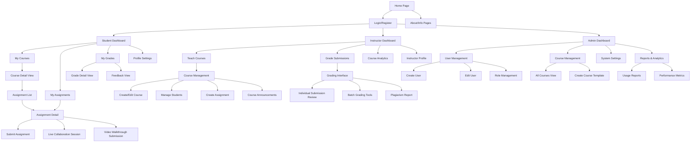

```mermaid
graph TD
    A[Home Page] --> B[Login/Register]
    A --> C[About/Info Pages]

    B --> D[Student Dashboard]
    B --> E[Instructor Dashboard]
    B --> F[Admin Dashboard]

    %% Student Flow
    D --> G[My Courses]
    D --> H[My Assignments]
    D --> I[My Grades]
    D --> J[Profile Settings]

    G --> K[Course Detail View]
    K --> L[Assignment List]
    L --> M[Assignment Detail]
    M --> N[Submit Assignment]
    M --> O[Live Collaboration Session]
    M --> P[Video Walkthrough Submission]

    H --> M
    I --> Q[Grade Detail View]
    I --> R[Feedback View]

    %% Instructor Flow
    E --> S[Teach Courses]
    E --> T[Grade Submissions]
    E --> U[Course Analytics]
    E --> V[Instructor Profile]

    S --> W[Course Management]
    W --> X[Create/Edit Course]
    W --> Y[Manage Students]
    W --> Z[Create Assignment]
    W --> AA[Course Announcements]

    T --> BB[Grading Interface]
    BB --> CC[Individual Submission Review]
    BB --> DD[Batch Grading Tools]
    BB --> EE[Plagiarism Report]

    %% Admin Flow
    F --> FF[User Management]
    F --> GG[Course Management]
    F --> HH[System Settings]
    F --> II[Reports & Analytics]

    FF --> JJ[Create User]
    FF --> KK[Edit User]
    FF --> LL[Role Management]

    GG --> MM[All Courses View]
    GG --> NN[Create Course Template]

    II --> OO[Usage Reports]
    II --> PP[Performance Metrics]
```
