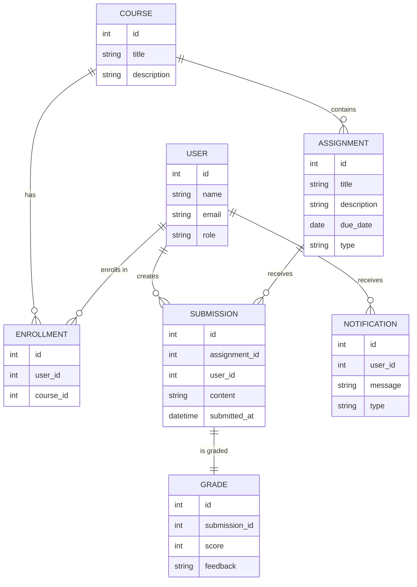

```mermaid
erDiagram
    USER {
        int id
        string name
        string email
        string role
    }

    COURSE {
        int id
        string title
        string description
    }

    ENROLLMENT {
        int id
        int user_id
        int course_id
    }

    ASSIGNMENT {
        int id
        string title
        string description
        date due_date
        string type
    }

    SUBMISSION {
        int id
        int assignment_id
        int user_id
        string content
        datetime submitted_at
    }

    GRADE {
        int id
        int submission_id
        int score
        string feedback
    }

    NOTIFICATION {
        int id
        int user_id
        string message
        string type
    }

    %% Relationships
    USER ||--o{ ENROLLMENT : "enrolls in"
    COURSE ||--o{ ENROLLMENT : "has"
    COURSE ||--o{ ASSIGNMENT : "contains"
    ASSIGNMENT ||--o{ SUBMISSION : "receives"
    SUBMISSION ||--|| GRADE : "is graded"
    USER ||--o{ SUBMISSION : "creates"
    USER ||--o{ NOTIFICATION : "receives"
```