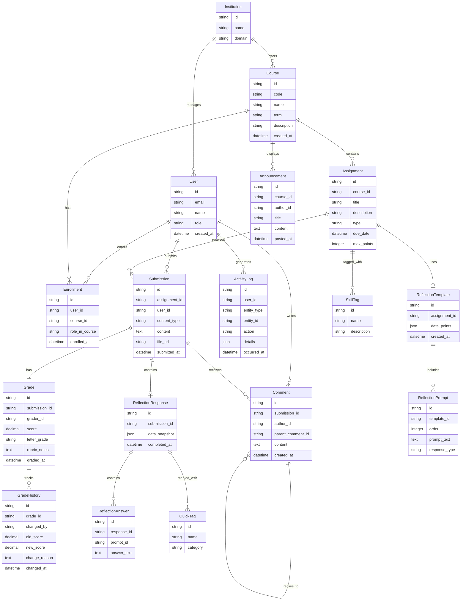

```mermaid
erDiagram
    Institution ||--o{ Course : offers
    Institution ||--o{ User : manages
    
    User ||--o{ Enrollment : enrolls
    User ||--o{ Submission : submits
    User ||--o{ Comment : writes
    User ||--o{ ActivityLog : generates
    
    Course ||--o{ Enrollment : has
    Course ||--o{ Assignment : contains
    Course ||--o{ Announcement : displays
    
    Assignment ||--o{ Submission : receives
    Assignment ||--o| ReflectionTemplate : uses
    Assignment ||--o{ SkillTag : tagged_with
    
    Submission ||--|| Grade : has
    Submission ||--o{ Comment : receives
    Submission ||--o| ReflectionResponse : contains
    
    Grade ||--o{ GradeHistory : tracks
    
    Comment ||--o{ Comment : replies_to
    
    ReflectionTemplate ||--o{ ReflectionPrompt : includes
    
    ReflectionResponse ||--o{ ReflectionAnswer : contains
    ReflectionResponse ||--o{ QuickTag : marked_with
    
    User {
        string id
        string email
        string name
        string role
        datetime created_at
    }
    
    Institution {
        string id
        string name
        string domain
    }
    
    Course {
        string id
        string code
        string name
        string term
        string description
        datetime created_at
    }
    
    Enrollment {
        string id
        string user_id
        string course_id
        string role_in_course
        datetime enrolled_at
    }
    
    Assignment {
        string id
        string course_id
        string title
        string description
        string type
        datetime due_date
        integer max_points
    }
    
    Submission {
        string id
        string assignment_id
        string user_id
        string content_type
        text content
        string file_url
        datetime submitted_at
    }
    
    Grade {
        string id
        string submission_id
        string grader_id
        decimal score
        string letter_grade
        text rubric_notes
        datetime graded_at
    }
    
    GradeHistory {
        string id
        string grade_id
        string changed_by
        decimal old_score
        decimal new_score
        text change_reason
        datetime changed_at
    }
    
    Comment {
        string id
        string submission_id
        string author_id
        string parent_comment_id
        text content
        datetime created_at
    }
    
    ReflectionTemplate {
        string id
        string assignment_id
        json data_points
        datetime created_at
    }
    
    ReflectionPrompt {
        string id
        string template_id
        integer order
        text prompt_text
        string response_type
    }
    
    ReflectionResponse {
        string id
        string submission_id
        json data_snapshot
        datetime completed_at
    }
    
    ReflectionAnswer {
        string id
        string response_id
        string prompt_id
        text answer_text
    }
    
    QuickTag {
        string id
        string name
        string category
    }
    
    SkillTag {
        string id
        string name
        string description
    }
    
    Announcement {
        string id
        string course_id
        string author_id
        string title
        text content
        datetime posted_at
    }
    
    ActivityLog {
        string id
        string user_id
        string entity_type
        string entity_id
        string action
        json details
        datetime occurred_at
    }
```