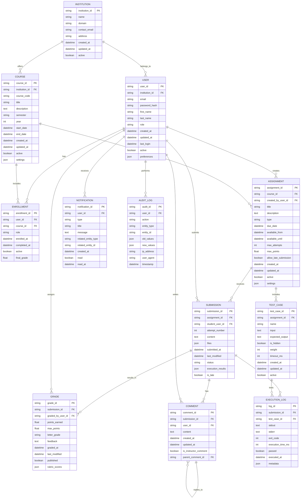

# Data Model - Learning Management System

## Entity Relationship Diagram



## Entity Descriptions

### Core Entities

#### INSTITUTION
Represents educational institutions using the LMS platform.
- **Primary Key:** `institution_id` - Unique identifier for the institution
- **Business Rules:**
  - Each institution has a unique domain for email validation
  - Institutions can be deactivated but not deleted to maintain data integrity
  - Institution settings control system-wide policies

#### USER
Represents all system users (Students, Professors, TAs, Admins).
- **Primary Key:** `user_id` - Unique identifier for each user
- **Roles:** `student`, `professor`, `ta`, `admin`
- **Business Rules:**
  - Email must be unique within an institution
  - Password must meet security requirements
  - Users can have multiple roles within different courses
  - Preferences stored as JSON for extensibility

#### COURSE
Represents academic courses offered by institutions.
- **Primary Key:** `course_id` - Unique identifier for each course
- **Business Rules:**
  - Course codes must be unique within an institution per semester
  - Courses have defined start and end dates
  - Course settings include enrollment policies and feature flags

### Academic Content

#### ENROLLMENT
Links users to courses with specific roles and permissions.
- **Primary Key:** `enrollment_id` - Unique identifier for enrollment record
- **Roles:** `student`, `professor`, `ta`
- **Business Rules:**
  - A user can have multiple enrollments in the same course with different roles
  - Only active enrollments grant access to course content
  - Final grades are calculated and cached here

#### ASSIGNMENT
Represents tasks and assessments within courses.
- **Primary Key:** `assignment_id` - Unique identifier for each assignment
- **Types:** `file_upload`, `text_response`, `interactive_code`
- **Business Rules:**
  - Due dates must be after available_from dates
  - Interactive code assignments must have associated test cases
  - Settings JSON stores type-specific configuration

#### SUBMISSION
Student responses to assignments.
- **Primary Key:** `submission_id` - Unique identifier for each submission
- **Business Rules:**
  - Students can have multiple attempts if allowed by assignment
  - Content and files stored based on assignment type
  - Execution results cached for interactive code submissions

### Assessment & Feedback

#### GRADE
Evaluation and scoring of student submissions.
- **Primary Key:** `grade_id` - Unique identifier for each grade
- **Business Rules:**
  - Points earned cannot exceed maximum points
  - Grades can be unpublished for revisions
  - Rubric scores stored as JSON for detailed feedback

#### COMMENT
Discussion and feedback on submissions.
- **Primary Key:** `comment_id` - Unique identifier for each comment
- **Business Rules:**
  - Comments can be nested (replies to other comments)
  - Instructor comments are highlighted differently
  - Comments are immutable once created (track edits via updated_at)

### Interactive Code Features

#### TEST_CASE
Automated tests for interactive code assignments.
- **Primary Key:** `test_case_id` - Unique identifier for each test case
- **Business Rules:**
  - Hidden test cases are not visible to students
  - Weight determines importance in overall score
  - Timeout prevents infinite loops in student code

#### EXECUTION_LOG
Records of code execution attempts.
- **Primary Key:** `log_id` - Unique identifier for each execution
- **Business Rules:**
  - All execution attempts are logged for security and debugging
  - Execution time is tracked for performance analysis
  - Pass/fail determined by comparing output to expected results

### System Management

#### NOTIFICATION
System-generated messages for users.
- **Primary Key:** `notification_id` - Unique identifier for each notification
- **Types:** `grade_published`, `assignment_due`, `course_announcement`
- **Business Rules:**
  - Notifications are marked as read when viewed
  - Related entity references allow deep linking

#### AUDIT_LOG
Comprehensive logging of all system actions.
- **Primary Key:** `audit_id` - Unique identifier for each audit record
- **Business Rules:**
  - All data modifications are logged
  - Old and new values captured for change tracking
  - IP address and user agent stored for security analysis

## Relationships and Cardinalities

### One-to-Many Relationships
- **Institution** → **User** (1:N) - An institution has many users
- **Institution** → **Course** (1:N) - An institution offers many courses
- **Course** → **Assignment** (1:N) - A course contains many assignments
- **Assignment** → **Submission** (1:N) - An assignment receives many submissions
- **Assignment** → **Test Case** (1:N) - A code assignment has many test cases
- **Submission** → **Grade** (1:1) - Each submission has one grade
- **Submission** → **Comment** (1:N) - A submission can have many comments
- **Submission** → **Execution Log** (1:N) - Code submissions generate execution logs

### Many-to-Many Relationships
- **User** ↔ **Course** (M:N) via **Enrollment** - Users can enroll in multiple courses
- **Comment** → **Comment** (self-referencing) - Comments can reply to other comments

### Key Business Constraints

#### Data Integrity
- **Cascade Deletes:** Deleting a course removes all assignments, submissions, and grades
- **Soft Deletes:** Users and institutions are deactivated rather than deleted
- **Referential Integrity:** All foreign key relationships enforce data consistency

#### Security Constraints
- **Access Control:** Users can only access data within their enrolled institutions/courses
- **Code Execution:** All code runs in sandboxed environments with resource limits
- **Data Encryption:** Sensitive fields (passwords, personal info) encrypted at rest

#### Performance Considerations
- **Indexing Strategy:**
  - Primary keys and foreign keys automatically indexed
  - Additional indexes on frequently queried fields (email, course_code, due_date)
  - Composite indexes for common query patterns

- **Caching Strategy:**
  - Course enrollment data cached for quick access checks
  - Execution results cached to avoid re-running code
  - Grade calculations cached to improve gradebook performance

## Sample Data Queries

### Common Query Patterns

#### Get Student's Current Courses
```sql
SELECT c.course_code, c.title, c.semester, c.year
FROM courses c
JOIN enrollments e ON c.course_id = e.course_id
WHERE e.user_id = :student_id 
  AND e.role = 'student' 
  AND e.active = true
  AND c.active = true;
```

#### Get Ungraded Submissions for Professor
```sql
SELECT s.submission_id, u.first_name, u.last_name, a.title, s.submitted_at
FROM submissions s
JOIN assignments a ON s.assignment_id = a.assignment_id
JOIN users u ON s.student_user_id = u.user_id
LEFT JOIN grades g ON s.submission_id = g.submission_id
WHERE a.course_id = :course_id 
  AND g.grade_id IS NULL
ORDER BY s.submitted_at ASC;
```

#### Execute Code Assignment Tests
```sql
SELECT tc.test_case_id, tc.input, tc.expected_output, tc.is_hidden
FROM test_cases tc
WHERE tc.assignment_id = :assignment_id 
  AND tc.active = true
ORDER BY tc.weight DESC;
```

## Scalability Considerations

### Database Partitioning
- **Horizontal Partitioning:** Partition large tables (submissions, execution_logs) by date
- **Vertical Partitioning:** Separate frequently accessed data from historical data

### Archive Strategy
- **Cold Storage:** Move old submissions and logs to archive tables after semester ends
- **Data Retention:** Implement policies for permanent deletion of old execution logs

### Performance Optimization
- **Read Replicas:** Use read replicas for reporting and analytics queries
- **Connection Pooling:** Implement connection pooling for high-concurrency scenarios
- **Query Optimization:** Regular analysis of slow queries and index optimization