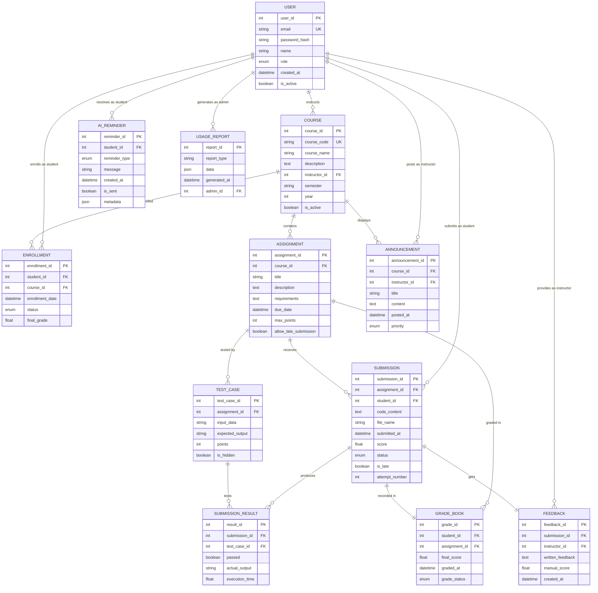

```mermaid
erDiagram
    USER {
        int user_id PK
        string email UK
        string password_hash
        string name
        enum role
        datetime created_at
        boolean is_active
    }

    COURSE {
        int course_id PK
        string course_code UK
        string course_name
        text description
        int instructor_id FK
        string semester
        int year
        boolean is_active
    }

    ENROLLMENT {
        int enrollment_id PK
        int student_id FK
        int course_id FK
        datetime enrollment_date
        enum status
        float final_grade
    }

    ASSIGNMENT {
        int assignment_id PK
        int course_id FK
        string title
        text description
        text requirements
        datetime due_date
        int max_points
        boolean allow_late_submission
    }

    TEST_CASE {
        int test_case_id PK
        int assignment_id FK
        string input_data
        string expected_output
        int points
        boolean is_hidden
    }

    SUBMISSION {
        int submission_id PK
        int assignment_id FK
        int student_id FK
        text code_content
        string file_name
        datetime submitted_at
        float score
        enum status
        boolean is_late
        int attempt_number
    }

    SUBMISSION_RESULT {
        int result_id PK
        int submission_id FK
        int test_case_id FK
        boolean passed
        string actual_output
        float execution_time
    }

    FEEDBACK {
        int feedback_id PK
        int submission_id FK
        int instructor_id FK
        text written_feedback
        float manual_score
        datetime created_at
    }

    ANNOUNCEMENT {
        int announcement_id PK
        int course_id FK
        int instructor_id FK
        string title
        text content
        datetime posted_at
        enum priority
    }

    AI_REMINDER {
        int reminder_id PK
        int student_id FK
        enum reminder_type
        string message
        datetime created_at
        boolean is_sent
        json metadata
    }

    GRADE_BOOK {
        int grade_id PK
        int student_id FK
        int assignment_id FK
        float final_score
        datetime graded_at
        enum grade_status
    }

    USAGE_REPORT {
        int report_id PK
        string report_type
        json data
        datetime generated_at
        int admin_id FK
    }

    %% Relationships
    USER ||--o{ COURSE : "instructs"
    USER ||--o{ ENROLLMENT : "enrolls as student"
    USER ||--o{ FEEDBACK : "provides as instructor"
    USER ||--o{ ANNOUNCEMENT : "posts as instructor"
    USER ||--o{ AI_REMINDER : "receives as student"
    USER ||--o{ SUBMISSION : "submits as student"
    USER ||--o{ USAGE_REPORT : "generates as admin"

    COURSE ||--o{ ENROLLMENT : "has enrolled"
    COURSE ||--o{ ASSIGNMENT : "contains"
    COURSE ||--o{ ANNOUNCEMENT : "displays"

    ASSIGNMENT ||--o{ TEST_CASE : "tested by"
    ASSIGNMENT ||--o{ SUBMISSION : "receives"
    ASSIGNMENT ||--o{ GRADE_BOOK : "graded in"

    SUBMISSION ||--o{ SUBMISSION_RESULT : "produces"
    SUBMISSION ||--|| FEEDBACK : "gets"
    SUBMISSION ||--|| GRADE_BOOK : "recorded in"

    TEST_CASE ||--o{ SUBMISSION_RESULT : "tests"

```
