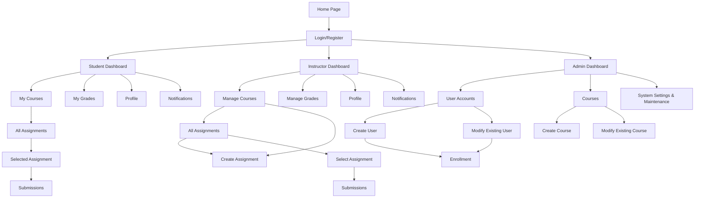

```mermaid
graph TD
    1[Home Page] --> B[Login/Register]
    B --> S[Student Dashboard]
    B --> I[Instructor Dashboard]
    B --> A[Admin Dashboard]

    %%  Student View
    S --> S1[My Courses]
    S --> S2[My Grades]
    S --> S3[Profile]
    S --> S4[Notifications]
    S1 --> S5[All Assignments]
    S5 --> S6[Selected Assignment]
    S6 --> S7[Submissions]

    %% Instructor View
    I --> I1[Manage Courses]
    I --> T2[Manage Grades]
    I --> I3[Profile]
    I --> I4[Notifications]
    I1 --> I5[All Assignments]
    I1 --> I6[Create Assignment]
    I5 --> I6[Create Assignment]
    I5 --> I7[Select Assignment]
    I7 --> I8[Submissions]

    %% Administrator View
    A --> A1[User Accounts]
    A --> A2[Courses]
    A --> A3[System Settings & Maintenance]
    A1 --> A4[Create User]
    A1 --> A5[Modify Existing User]
    A2 --> A6[Create Course]
    A2 --> A7[Modify Existing Course]
    A4 --> A8[Enrollment]
    A5 --> A8[Enrollment]
```