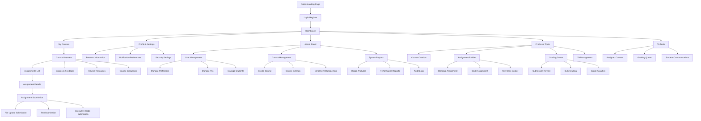

# Site Map - Learning Management System

## Navigation Hierarchy

## Detailed Page Descriptions

### Public Pages

#### Landing Page (`/`)
- **Purpose:** Marketing page for the LMS platform
- **Content:** Feature highlights, testimonials, pricing information
- **Actions:** Navigate to login/register, learn more about features
- **Users:** Anonymous visitors

#### Login Page (`/login`)
- **Purpose:** User authentication entry point
- **Content:** Login form, forgot password link, register link
- **Actions:** Authenticate with email/password, navigate to registration
- **Users:** All user types (unauthenticated)

#### Register Page (`/register`)
- **Purpose:** New user account creation
- **Content:** Registration form with role selection
- **Actions:** Create new account, navigate back to login
- **Users:** New users (with institution approval for some roles)

### Authenticated Pages

#### Dashboard (`/dashboard`)
- **Purpose:** Personalized home page after login
- **Content:** 
  - Recent activity feed
  - Upcoming assignments and due dates
  - Quick access to enrolled courses
  - Notifications and announcements
- **Actions:** Navigate to courses, view notifications, quick assignment submission
- **Users:** All authenticated users (content varies by role)

### Course Management

#### My Courses (`/courses`)
- **Purpose:** List of all courses user is enrolled in or teaching
- **Content:** 
  - Course cards with progress indicators
  - Search and filter functionality
  - Enrollment status and role indicators
- **Actions:** Access course, enroll in new courses, search courses
- **Users:** Students, Professors, TAs

#### Course Overview (`/courses/[courseId]`)
- **Purpose:** Main course hub with navigation to all course features
- **Content:**
  - Course description and syllabus
  - Recent announcements
  - Navigation to assignments, grades, resources
  - Class roster (for instructors)
- **Actions:** Navigate to course sections, post announcements (instructors)
- **Users:** Enrolled students, assigned professors/TAs

#### Assignments List (`/courses/[courseId]/assignments`)
- **Purpose:** View all assignments for a specific course
- **Content:**
  - Assignment list with due dates and status
  - Filter by assignment type, status, due date
  - Progress indicators and grade summaries
- **Actions:** Access individual assignments, filter/sort list
- **Users:** Students (view/submit), Professors/TAs (manage/grade)

#### Assignment Details (`/courses/[courseId]/assignments/[assignmentId]`)
- **Purpose:** View assignment instructions and requirements
- **Content:**
  - Detailed instructions and rubrics
  - Due dates and submission requirements
  - Previous submission history
  - Grade and feedback (if available)
- **Actions:** Start submission, view feedback, download resources
- **Users:** Students (submit), Professors/TAs (manage)

### Assignment Submissions

#### File Upload Submission (`/courses/[courseId]/assignments/[assignmentId]/submit/file`)
- **Purpose:** Submit file-based assignments
- **Content:**
  - File upload interface with drag-and-drop
  - File type restrictions and size limits
  - Previous submission history
- **Actions:** Upload files, submit assignment, save draft
- **Users:** Students

#### Text Submission (`/courses/[courseId]/assignments/[assignmentId]/submit/text`)
- **Purpose:** Submit text-based responses
- **Content:**
  - Rich text editor with formatting options
  - Character/word count indicators
  - Auto-save functionality
- **Actions:** Write response, save draft, submit assignment
- **Users:** Students

#### Interactive Code Submission (`/courses/[courseId]/assignments/[assignmentId]/submit/code`)
- **Purpose:** Submit and test code assignments (Unique Feature)
- **Content:**
  - Code editor with syntax highlighting
  - Test case runner with sample tests
  - Console output and error display
  - Submission history with test results
- **Actions:** Write code, run tests, submit when ready, view execution results
- **Users:** Students

### Grading and Feedback

#### Grades & Feedback (`/courses/[courseId]/grades`)
- **Purpose:** View all grades and feedback for a course
- **Content:**
  - Grade book view with assignment breakdown
  - Individual assignment feedback
  - Progress tracking and analytics
- **Actions:** View detailed feedback, track progress over time
- **Users:** Students (view own), Professors/TAs (view all)

#### Grading Center (`/courses/[courseId]/grading`)
- **Purpose:** Grade student submissions (Instructors only)
- **Content:**
  - List of submissions requiring grading
  - Rubric-based grading interface
  - Code execution and testing tools
  - Bulk grading options
- **Actions:** Grade submissions, provide feedback, execute student code, publish grades
- **Users:** Professors, TAs

### Administrative Features

#### User Management (`/admin/users`)
- **Purpose:** Manage system users (Institution Admins only)
- **Content:**
  - User directory with search and filter
  - Role management interface
  - Account status and permissions
- **Actions:** Create users, modify roles, deactivate accounts, bulk operations
- **Users:** Institution Administrators

#### Course Management (`/admin/courses`)
- **Purpose:** Oversee all courses in the system
- **Content:**
  - Course directory with enrollment statistics
  - Course creation and configuration tools
  - Performance metrics per course
- **Actions:** Create courses, assign instructors, monitor course health
- **Users:** Institution Administrators, Professors

#### System Reports (`/admin/reports`)
- **Purpose:** Generate system-wide analytics and reports
- **Content:**
  - Usage statistics and trends
  - Performance metrics
  - Security audit logs
  - Export capabilities
- **Actions:** Generate reports, export data, configure report parameters
- **Users:** Institution Administrators

### User Account Management

#### Profile & Settings (`/profile`)
- **Purpose:** Manage personal account information
- **Content:**
  - Personal information form
  - Notification preferences
  - Security settings (password change, 2FA)
  - Activity history
- **Actions:** Update profile, change password, configure notifications
- **Users:** All authenticated users

## User Flow Examples

### Student Submission Flow
1. Dashboard → My Courses → Course Overview → Assignments List → Assignment Details → Interactive Code Submission
2. Write code in editor → Run sample tests → Debug issues → Submit assignment → View results

### Professor Grading Flow
1. Dashboard → Course Overview → Grading Center → Select submission → Execute student code → Grade with rubric → Provide feedback → Publish grade

### Admin User Management Flow
1. Dashboard → Admin Panel → User Management → Create new user → Assign role → Send invitation → Monitor activation

## Mobile Considerations

### Responsive Breakpoints
- **Mobile:** < 768px - Single column, simplified navigation
- **Tablet:** 768px - 1024px - Adaptive layout with collapsible sidebar
- **Desktop:** > 1024px - Full feature set with multi-column layouts

### Mobile-Optimized Features
- Touch-friendly code editor for code submissions
- Simplified grading interface for tablet use
- Offline capability for draft saving
- Push notifications for assignment reminders