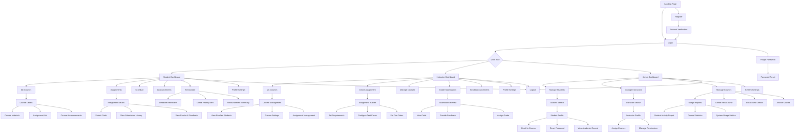

```mermaid
graph TD
    A[Landing Page] --> B[Login]
    B --> C{User Role}

    %% Student Flow
    C --> D[Student Dashboard]
    D --> E[My Courses]
    D --> F[Assignments]
    D --> G[Schedule]
    D --> H[Announcements]
    D --> I[AI Assistant]
    D --> J[Profile Settings]

    E --> K[Course Details]
    K --> L[Course Materials]
    K --> M[Assignment List]
    K --> N[Course Announcements]

    F --> O[Assignment Details]
    O --> P[Submit Code]
    O --> Q[View Submission History]
    O --> R[View Grades & Feedback]

    %% Instructor Flow
    C --> S[Instructor Dashboard]
    S --> T[My Courses]
    S --> U[Create Assignment]
    S --> V[Manage Courses]
    S --> W[Grade Submissions]
    S --> X[Send Announcements]
    S --> Y[Profile Settings]

    T --> Z[Course Management]
    Z --> AA[View Enrolled Students]
    Z --> BB[Course Settings]
    Z --> CC[Assignment Management]

    U --> DD[Assignment Builder]
    DD --> EE[Set Requirements]
    DD --> FF[Configure Test Cases]
    DD --> GG[Set Due Dates]

    W --> HH[Submission Review]
    HH --> II[View Code]
    HH --> KK[Provide Feedback]
    HH --> LL[Assign Grade]

    %% Admin Flow
    C --> MM[Admin Dashboard]
    MM --> NN[Manage Students]
    MM --> OO[Manage Instructors]
    MM --> PP[Manage Courses]
    PP --> QQ[Usage Reports]
    MM --> RR[System Settings]

    NN --> SS[Student Search]
    SS --> TT[Student Profile]
    TT --> UU[Enroll in Courses]
    TT --> VV[Reset Password]
    TT --> WW[View Academic Record]

    OO --> XX[Instructor Search]
    XX --> YY[Instructor Profile]
    YY --> ZZ[Assign Courses]
    YY --> AAA[Manage Permissions]

    PP --> BBB[Create New Course]
    PP --> CCC[Edit Course Details]
    PP --> DDD[Archive Course]

    QQ --> EEE[Student Activity Report]
    QQ --> FFF[Course Statistics]
    QQ --> GGG[System Usage Metrics]

    %% Shared Components
    D --> HHH[Logout]
    S --> HHH
    MM --> HHH

    %% AI Assistant Features
    I --> III[Deadline Reminders]
    I --> JJJ[Grade Priority Alert]
    I --> KKK[Announcement Summary]

    %% Authentication Flow
    A --> LLL[Register]
    LLL --> MMM[Account Verification]
    MMM --> B
    B --> NNN[Forgot Password]
    NNN --> OOO[Password Reset]
```
