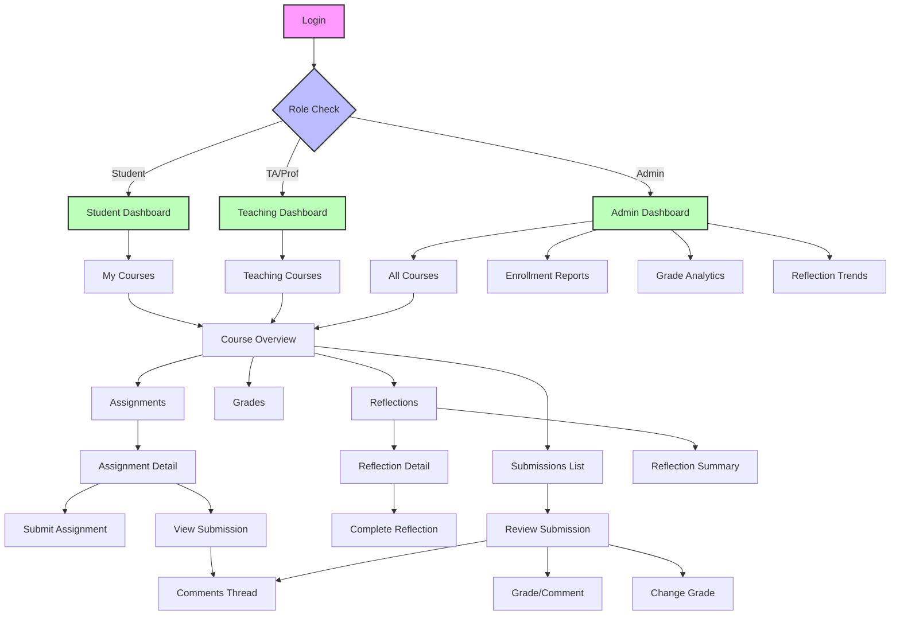

# LMS MVP Site Map

## Page Overview

### Authentication
* **Login** - School email authentication entry point

### Core Pages
* **Dashboard** - Role-based home view
  * My Courses (Student)
  * Teaching Courses (TA/Professor)
  * System Overview (Admin)

### Course Management
* **Course Overview** - Announcements, roster, quick stats
* **Assignments** - List view with filters and sorting
* **Assignment Detail** - Specifications, due date, submission link
* **Submit Assignment** - Upload/text/reflection interface
* **Grades** - Table view with filters

### Submission Flow
* **Submissions List** - TA/Professor view of student work
* **Submission Review** - Grading and comment interface
* **Grade Change** - Form with reason field

### Reflection Pages
* **Reflections List** - Course reflection assignments
* **Reflection Detail** - Template and instructions
* **Complete Reflection** - Data summary + prompt interface
* **Reflection Summary** - TA/Professor aggregate view

### Administrative
* **Admin Dashboard** - System-wide metrics
* **All Courses** - Full course catalog
* **Enrollment Report** - Counts and distributions
* **Grade Analytics** - Aggregate grade data
* **Reflection Trends** - Cross-course reflection analysis

---

## Navigation Flow



---

## URL Structure

### Public Routes
* `/` - Landing/Login
* `/login` - Authentication

### Student Routes
* `/dashboard` - Student dashboard
* `/courses` - My courses list
* `/courses/:id` - Course overview
* `/courses/:id/assignments` - Assignment list
* `/courses/:id/assignments/:aid` - Assignment detail
* `/courses/:id/assignments/:aid/submit` - Submission form
* `/courses/:id/grades` - My grades
* `/courses/:id/reflections` - Reflection list
* `/courses/:id/reflections/:rid` - Complete reflection
* `/submissions/:sid` - View own submission

### TA/Professor Routes
* `/teaching` - Teaching dashboard
* `/teaching/:cid/submissions` - All submissions
* `/teaching/:cid/submissions/:sid` - Review submission
* `/teaching/:cid/submissions/:sid/grade` - Grade interface
* `/teaching/:cid/reflections/:rid/summary` - Reflection responses
* `/courses/:id/manage` - Course management

### Admin Routes
* `/admin` - Admin dashboard
* `/admin/courses` - All courses
* `/admin/enrollment` - Enrollment reports
* `/admin/grades` - Grade analytics
* `/admin/reflections` - Reflection trends
* `/admin/activity` - System activity log

---

## Page Hierarchy

```
Root
├── Authentication
│   └── Login
├── Dashboards
│   ├── Student Dashboard
│   ├── Teaching Dashboard
│   └── Admin Dashboard
├── Courses
│   ├── Course List
│   └── Course Detail
│       ├── Overview
│       ├── Assignments
│       │   ├── List
│       │   ├── Detail
│       │   └── Submit
│       ├── Grades
│       └── Reflections
│           ├── List
│           ├── Complete
│           └── Summary
├── Submissions
│   ├── List (TA/Prof)
│   ├── Review
│   └── Grade
└── Admin
    ├── Courses
    ├── Enrollment
    ├── Analytics
    └── Activity
```

---

## Mobile Considerations

### Priority Mobile Views
1. Student Dashboard
2. Assignment List
3. Submit Assignment
4. View Grades
5. Complete Reflection

### Responsive Breakpoints
* Mobile: < 768px
* Tablet: 768px - 1024px
* Desktop: > 1024px

---

## Access Control Matrix

| Page | Student | TA | Professor | Admin |
|------|---------|-------|-----------|-------|
| Dashboard | ✓ | ✓ | ✓ | ✓ |
| My Courses | ✓ | - | - | - |
| Teaching Courses | - | ✓ | ✓ | - |
| Submit Assignment | ✓ | - | - | - |
| Grade Submissions | - | ✓ | ✓ | - |
| View All Courses | - | - | - | ✓ |
| System Analytics | - | - | - | ✓ |
| Reflection Summary | - | ✓ | ✓ | ✓ |