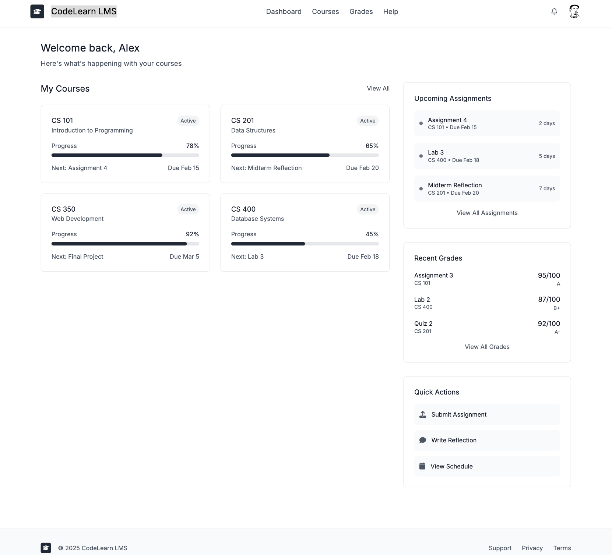
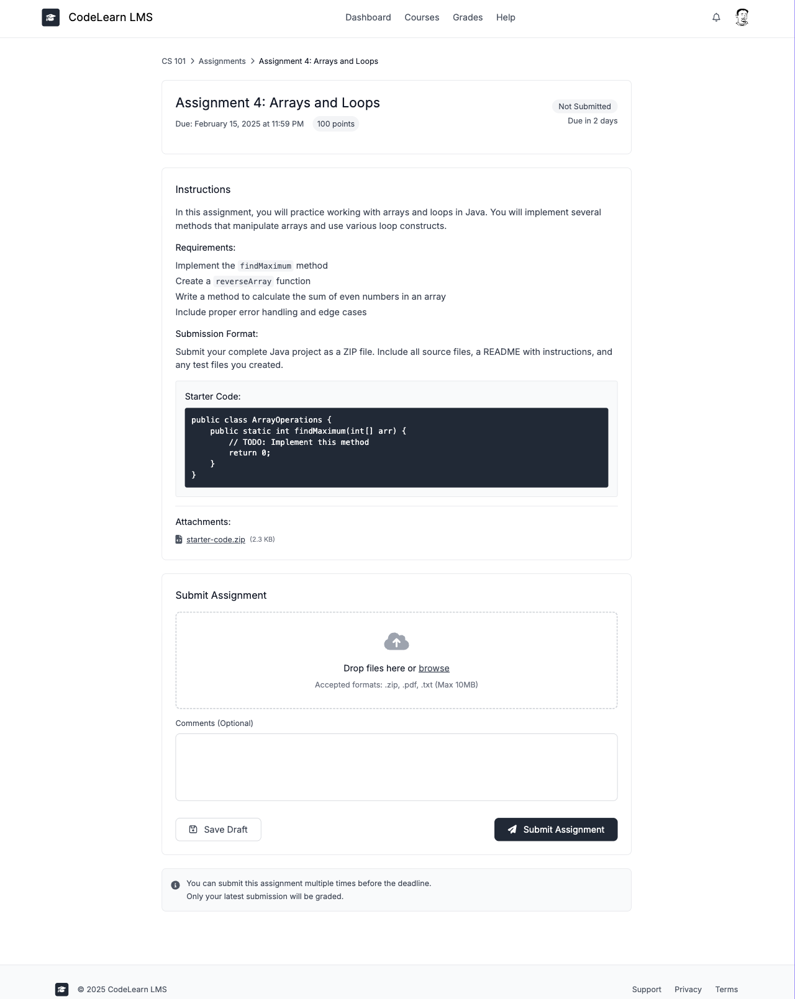
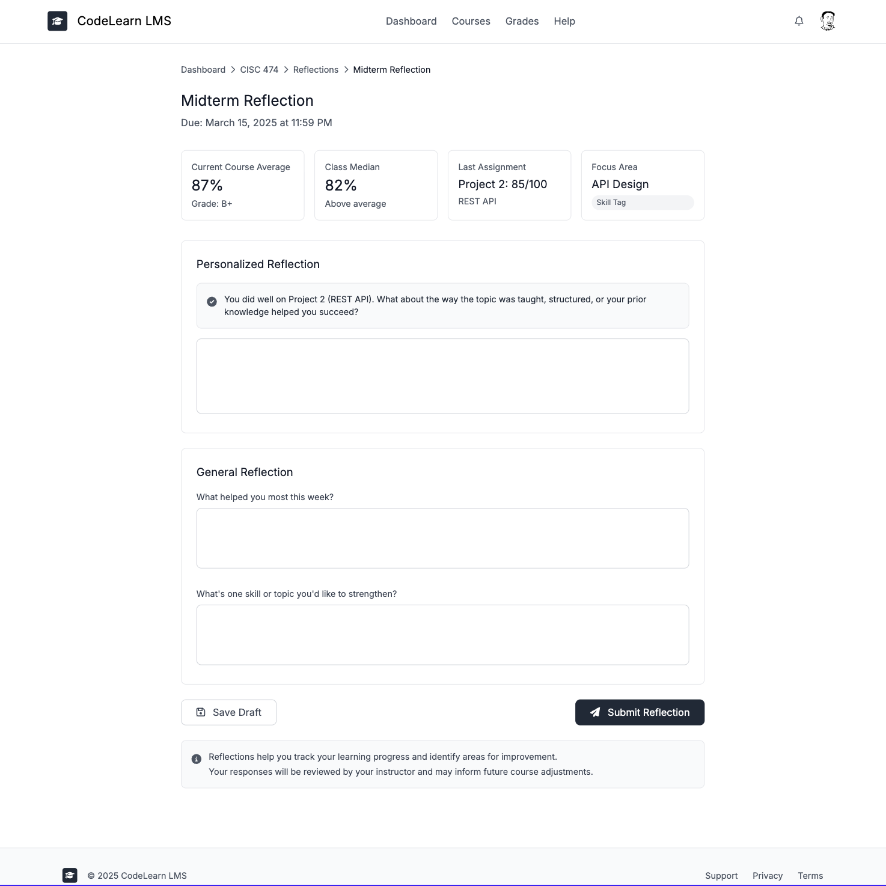
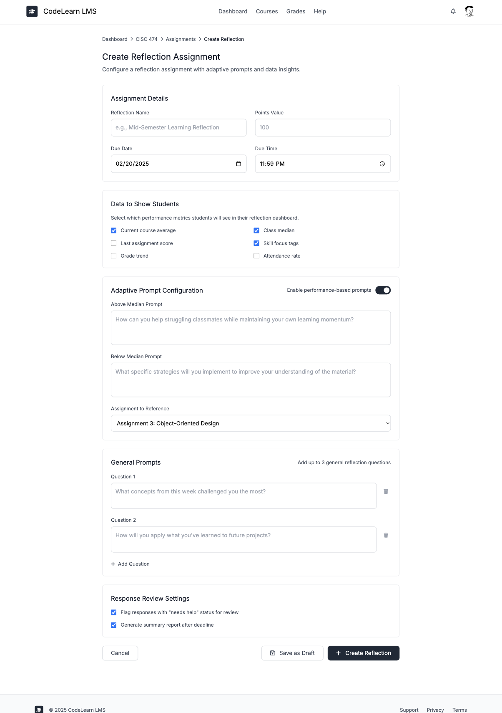

# LMS MVP Wireframes

## Overview

This document presents the key wireframes for the Learning Management System MVP, focusing on the core user flows for students, teaching assistants, professors, and administrators. The wireframes emphasize the unique Reflection submission feature that provides data-driven, adaptive prompts based on student performance.

---

## Dashboard (Student View)

The dashboard provides students with an at-a-glance view of their courses and upcoming assignments. Key features include:
- Course cards showing active enrollments
- Upcoming assignments list with due dates
- Quick access to recent grades and notifications
- Role-based navigation appropriate for students

---

## Assignment Detail & Submit

The assignment submission interface handles multiple submission types:
- **File uploads** with drag-and-drop support (.zip, .pdf, .txt - max 10MB)
- **Text submissions** with rich text editor
- **Reflection assignments** that redirect to specialized reflection interface
- Clear display of requirements, due dates, and point values
- Optional comments field for submission notes

---

## Reflection - Student View (Unique Feature)

The adaptive reflection interface is the system's distinctive feature:

### Data Snapshot Cards
- Current course average with grade letter
- Class median for comparison
- Last assignment score
- Highlighted skill focus tag

### Adaptive Prompts
- **Performance-based questions** that change based on student's standing relative to class median
- Above median: Focus on what helped them succeed
- Below median: Identify struggles and needed support

### General Reflection
- Structured prompts for weekly reflection
- Skill selection for focused improvement

---

## Reflection - Professor View (Assignment Creation)

The professor's reflection creation interface allows customization of the adaptive reflection experience:

### Configuration Options
- Select which data metrics students will see
- Toggle performance-based adaptive prompts
- Customize prompts for above/below median scenarios
- Add general reflection questions

### Review Settings
- Flag responses needing attention
- Generate summary reports
- Filter by quick tags (needs help, on track, confident)

---

## Design System

### Visual Hierarchy
- Clear distinction between primary actions and secondary options
- Consistent spacing and alignment across all views
- Card-based layouts for organized content sections

### Color Coding
- **Blue (#2563eb)** - Primary actions and links
- **Green (#16a34a)** - Success states and above-median indicators
- **Amber (#d97706)** - Warnings and below-median indicators
- **Red (#dc2626)** - Errors and overdue items
- **Gray (#6b7280)** - Disabled states and secondary text

### Responsive Considerations
- Mobile-first approach with stackable cards
- Touch-friendly targets (minimum 44px)
- Collapsible navigation for smaller screens
- Horizontal scrolling for data tables on mobile

### Accessibility Features
- High contrast ratios for text readability
- Clear focus indicators for keyboard navigation
- Descriptive labels for screen readers
- Semantic HTML structure

---

## User Flow Highlights

### Student Submission Flow
1. View assignment from course page
2. Read requirements and check due date
3. Upload file or enter text
4. Add optional comments
5. Submit and receive confirmation

### Reflection Flow (Unique)
1. Access reflection from assignments
2. Review personalized data snapshot
3. Respond to adaptive prompt based on performance
4. Complete general reflection questions
5. Select skill focus and status tags
6. Submit reflection

### Grading Flow (TA/Professor)
1. Access submissions list from course
2. Review student submission
3. Enter grade and rubric notes
4. Add comments with threading
5. Submit grade or save draft

---

## Implementation Notes

### State Management
- **Not Submitted** - Default state for new assignments
- **Draft Saved** - Auto-save functionality for in-progress work
- **Submitted** - Confirmation with timestamp
- **Graded** - Display score with feedback link
- **Late** - Visual warning for past-due submissions

### Form Validation
- Required field indicators (asterisk)
- Inline error messages
- Disable submit until requirements met
- Success confirmations after actions

### Data Integration
- Real-time grade calculations for reflection snapshots
- Dynamic median comparisons
- Automatic prompt selection based on performance thresholds
- Activity logging for grade changes