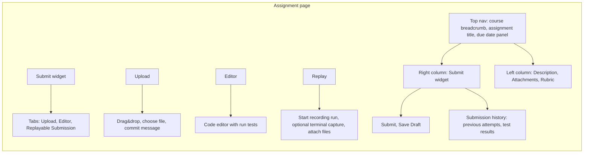

```mermaid
flowchart LR
  subgraph Assignment page
    Top[Top nav: course breadcrumb, assignment title, due date panel]
    Left[Left column: Description, Attachments, Rubric]
    Right[Right column: Submit widget]
    Submit[Submit widget] --> Tabs[Tabs: Upload, Editor, Replayable Submission]
    Upload --> FileInput[Drag&drop, choose file, commit message]
    Editor --> BuiltInEditor[Code editor with run tests]
    Replay --> Recorder[Start recording run, optional terminal capture, attach files]
    Right --> SubmitButton[Submit, Save Draft]
    Bottom[Submission history: previous attempts, test results]
  end
  Top --> Left
  Top --> Right
  Right --> Bottom
```