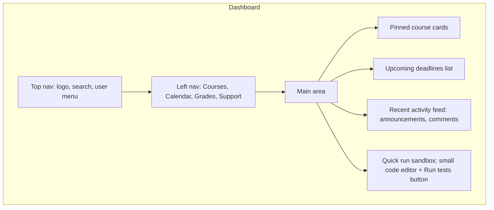

```mermaid
flowchart TB
  subgraph Dashboard
    A[Top nav: logo, search, user menu] 
    B[Left nav: Courses, Calendar, Grades, Support]
    C[Main area]
    C --> C1[Pinned course cards]
    C --> C2[Upcoming deadlines list]
    C --> C3[Recent activity feed: announcements, comments]
    C --> C4[Quick run sandbox: small code editor + Run tests button]
  end
  A --> B
  B --> C
```